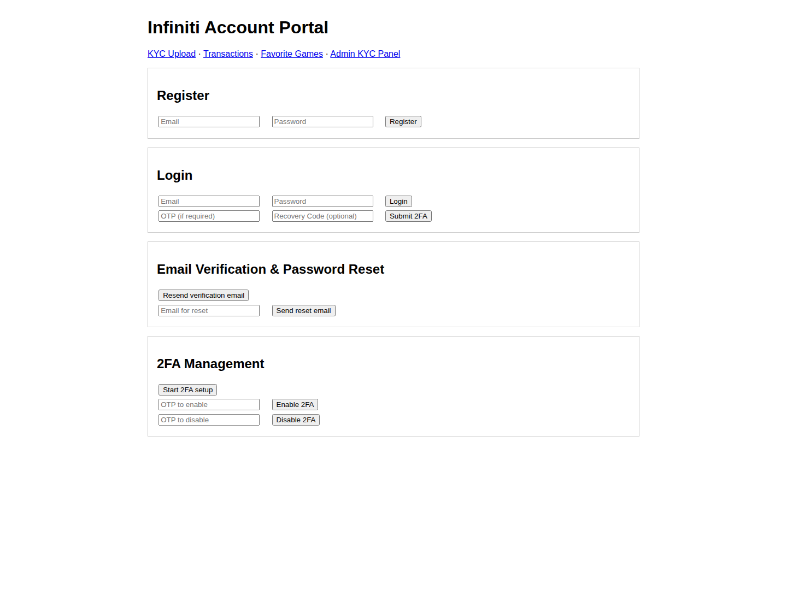
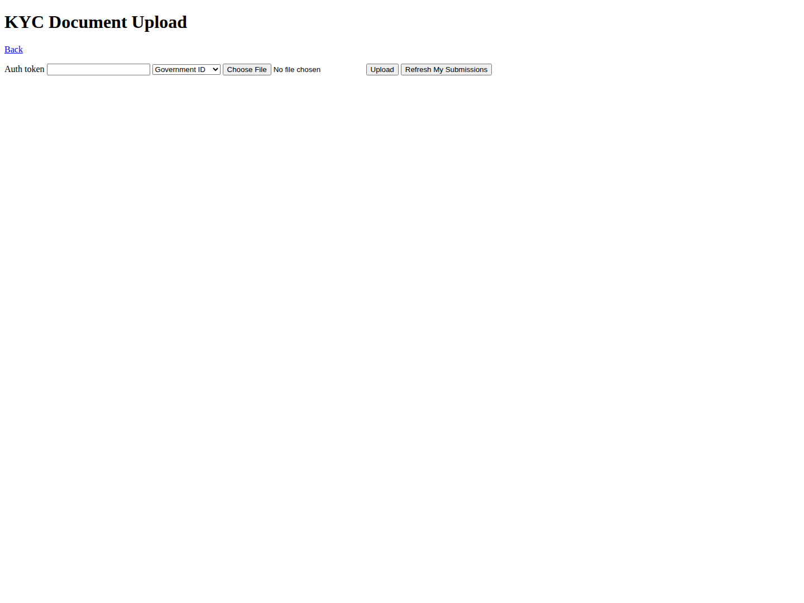
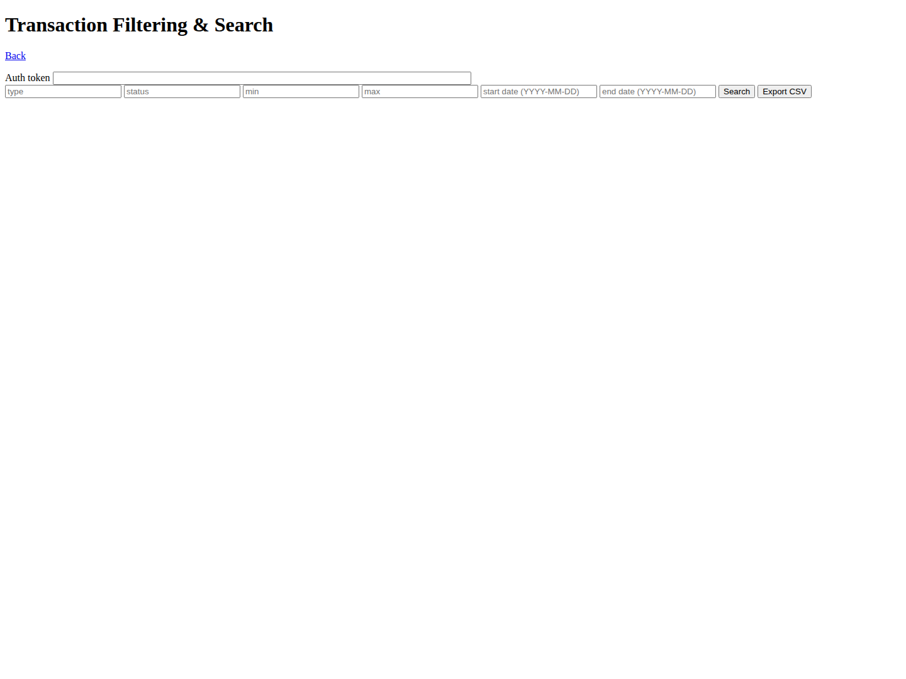

# Infiniti

[](https://github.com/GizzZmo/Infiniti/actions)
[](LICENSE)
[](https://en.cppreference.com/w/cpp/20)

A UCI chess engine written in C++20, featuring bitboard-based move generation, a tapered hand-crafted evaluator with NNUE support, and an alpha-beta search with modern pruning techniques.

> **Quick links:** [Building](docs/building.md) · [Usage](docs/usage.md) · [UCI Reference](docs/uci.md) · [FAQ](docs/faq.md) · [Wiki](docs/wiki/Home.md) · [Contributing](docs/contributing.md)

---

## Features

- **UCI protocol** — fully compatible with any UCI-capable chess GUI (Arena, Cute Chess, BanksiaGUI, etc.)
- **Bitboard representation** — all position data stored as 64-bit integers for fast bulk operations
- **Legal move generator** — generates all legal moves including en passant, castling, and promotions
- **Iterative deepening** — searches progressively deeper and returns the best move found so far if time runs out
- **Negamax with alpha-beta** — Principal Variation Search (PVS) for efficient tree pruning
- **Null move pruning** — skips the side to move to detect cut-nodes early (R = 2 or 3)
- **Late Move Reductions (LMR)** — reduces the search depth for moves that are unlikely to be best
- **Futility pruning** — skips quiet moves near the horizon when the position is far below alpha
- **Quiescence search** — extends the search through capture sequences to avoid the horizon effect
- **Transposition table** — caches previously searched positions to avoid redundant work
- **Move ordering** — TT move, MVV-LVA captures, killer moves, history heuristic
- **Tapered evaluation** — piece-square tables with smooth middlegame/endgame interpolation
- **Bishop pair bonus** and **passed pawn bonus**
- **NNUE support** — optional HalfKP neural network evaluator loaded at runtime

---

## Requirements

| Tool | Minimum version |
|------|----------------|
| C++ compiler | GCC 10 / Clang 12 / MSVC 19.29 (C++20 required) |
| CMake | 3.16 |

---

## Building

```bash
# Configure (release build)
cmake -B build -DCMAKE_BUILD_TYPE=Release

# Compile
cmake --build build --config Release -j$(nproc)

# The binary is at:
#   build/infiniti        (Linux/macOS)
#   build/Release/infiniti.exe  (Windows)
```

For a debug build with sanitizers enabled by default in the CI, replace `Release` with `Debug`.

---

## Usage

### With a GUI

Open your chess GUI, add a new engine, and point it at the compiled `infiniti` binary. The engine speaks the standard UCI protocol, so no further configuration is needed.

### Command line (UCI shell)

```
$ ./infiniti
uci
id name Infiniti
id author Infiniti Team
option name Hash type spin default 16 min 1 max 2048
option name Threads type spin default 1 min 1 max 1
option name Ponder type check default false
option name UCI_Chess960 type check default false
option name UseNNUE type check default true
option name EvalFile type string default
uciok
isready
readyok
position startpos moves e2e4 e7e5
go movetime 1000
info depth 1 seldepth 1 score cp 27 nodes 21 nps 21000 time 1 pv g1f3
...
bestmove g1f3
quit
```

---

## UCI Options

| Option | Type | Default | Description |
|--------|------|---------|-------------|
| `Hash` | spin | 16 | Transposition table size in megabytes (1 – 2048) |
| `Threads` | spin | 1 | Search threads (currently fixed to 1) |
| `Ponder` | check | false | Accepted for GUI compatibility |
| `UCI_Chess960` | check | false | Accepted for GUI compatibility |
| `UseNNUE` | check | true | Enable the NNUE neural network evaluator |
| `EvalFile` | string | *(empty)* | Path to an NNUE network file (`.nnue`) |

---

## Project Structure

```
Infiniti/
├── src/
│   ├── types.h          # Core types: Bitboard, Move, Square, Color, PieceType …
│   ├── bitboard.h/.cpp  # Bitboard utilities and attack tables
│   ├── position.h/.cpp  # Board state, FEN parsing, make/unmake move, Zobrist hashing
│   ├── movegen.h/.cpp   # Legal move and capture generation
│   ├── eval.h/.cpp      # Tapered HCE with PSTs, bishop pair, passed pawns
│   ├── tt.h             # Transposition table
│   ├── search.h/.cpp    # Iterative deepening, negamax, PVS, pruning, move ordering
│   ├── uci.h/.cpp       # UCI protocol loop and option handling
│   └── main.cpp         # Entry point
├── nnue/
│   ├── nnue.h/.cpp            # Public NNUE evaluator interface
│   ├── nnue_file.h/.cpp       # Binary network file loading
│   ├── features_halfkp.h/.cpp # HalfKP feature set
│   ├── accumulator.h/.cpp     # Incremental accumulator
│   └── network.h/.cpp         # Forward pass (L1→L2→L3→output)
├── CMakeLists.txt
├── LICENSE
├── ABOUT.md
└── docs/
    ├── building.md
    ├── usage.md
    ├── uci.md
    ├── search.md
    ├── evaluation.md
    ├── nnue.md
    ├── faq.md
    ├── contributing.md
    └── wiki/
        ├── Home.md
        ├── Getting-Started.md
        ├── Architecture.md
        └── Roadmap.md
```

---

## Documentation

Full documentation lives in the [`docs/`](docs/) directory:

| Page | Contents |
|------|----------|
| [Building](docs/building.md) | Detailed build instructions for all platforms |
| [Usage](docs/usage.md) | How to use the engine with GUIs and on the command line |
| [UCI Reference](docs/uci.md) | Complete UCI command reference |
| [Search](docs/search.md) | Search algorithm internals |
| [Evaluation](docs/evaluation.md) | Hand-crafted evaluator internals |
| [NNUE](docs/nnue.md) | NNUE architecture and usage |
| [FAQ](docs/faq.md) | Frequently asked questions |
| [Contributing](docs/contributing.md) | How to contribute |

### Wiki

In-depth guides and background articles are available in [`docs/wiki/`](docs/wiki/):

| Wiki Page | Contents |
|-----------|----------|
| [Home](docs/wiki/Home.md) | Wiki overview and navigation |
| [Getting Started](docs/wiki/Getting-Started.md) | Step-by-step first-run guide |
| [Architecture](docs/wiki/Architecture.md) | Deep-dive into the engine internals |
| [Roadmap](docs/wiki/Roadmap.md) | Planned features and future direction |

---

## CI/CD

This repository includes a **multi-language GitHub Actions pipeline** that detects which programming languages are present and runs the appropriate build, lint, test, and security checks in parallel.

```
ci.yml  (Orchestrator)
├── cpp-ci.yml                — CMake · clang-tidy · CTest (GCC, Clang, MSVC, AppleClang)
├── codeql-analysis.yml       — Security scanning (C/C++, and others if added)
├── dependency-review.yml     — CVE & licence scanning on pull requests
└── web-packaging.yml          — Web asset packaging + screenshot artifacts
```

A single `all-checks` job aggregates all results into one branch-protection gate.

The web workflow also validates the Node.js app, packages the `web/public` assets into `web/dist/assets`, captures screenshots of the UI pages, and uploads both artifact sets for inspection.

---

## Screenshots

| Page | Preview |
|------|---------|
| Registration / Login |  |
| KYC Upload |  |
| Transactions |  |
| Favorites |  |
| Admin KYC Review |  |
| Email Verification |  |
| Password Reset |  |

---

## Web Platform (Auth + KYC + Transactions + Favorites)

This repository now also includes a Node.js web platform in `/web` implementing:

- Email verification and password reset flows
- TOTP two-factor authentication with recovery codes
- KYC document upload and admin review endpoints
- Transaction filtering/search and CSV export
- Favorite games management UI and APIs

Quick start:

```bash
cd web
npm install
npm run start
```

Then open `http://localhost:3000`.

---

## License

[MIT](LICENSE) © 2026 Jon Arve Ovesen
